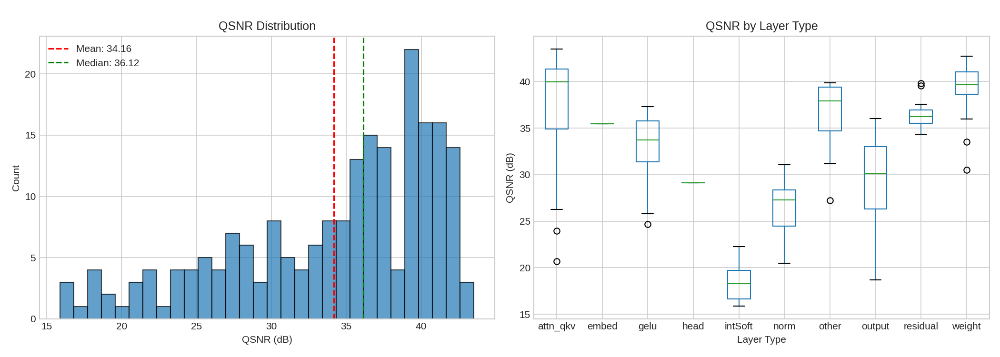
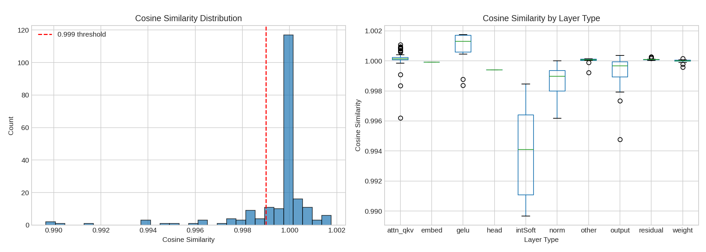
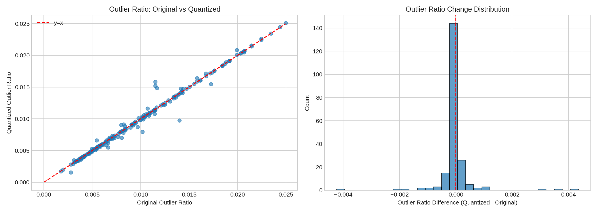
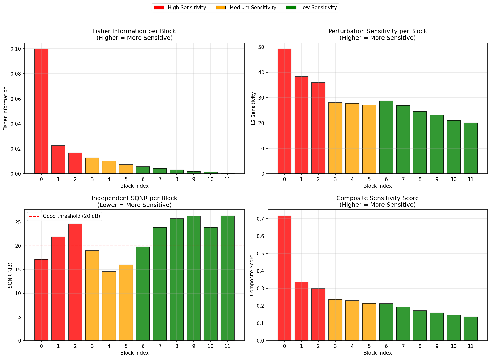

# FQ-ViT INT8 Quantization

Post-Training Quantization (PTQ) implementation for Vision Transformer (ViT) based on [FQ-ViT](https://arxiv.org/abs/2111.13824) paper.

## 1. Overview

This project implements INT8 post-training quantization for Vision Transformer with enhanced monitoring and profiling capabilities. Key improvements include:

- Unified quantization layer design for easier debugging
- Built-in profiler for layer-wise statistics collection
- Support for multiple observer types and calibration modes
- ONNX/TensorRT export for deployment

**Target Model:** `vit_base_patch16_224` (timm)

## 2. Features

- **Unified Quantization Module**: Most quantization logic implemented within a single layer class
- **Built-in Profiler**: Collects per-layer statistics (QSNR, MSE, cosine similarity, outlier ratio,KL divergence, histogram)
- **Multiple Observer Types**: MinMax, Percentile, OMSE, KL-Divergence
- **Calibration Modes**: Layer-wise, Channel-wise
- **Calibration Dataset**: ImageNet-mini (1,000 samples)

## 3. Installation

```bash
# Clone repository
git clone https://github.com/your-repo/Quant_trainning.git
cd Quant_trainning

# Install dependencies
pip install torch torchvision timm onnx onnxsim tensorrt pycuda
```

## 4. Experimental Results

| Metric | Original (FP32) | Quantized (INT8) | Difference (Δ) |
|--------|-----------------|------------------|----------------|
| **Top-1 Accuracy** | 81.09% | 79.84% | -1.25% |
| **Top-5 Accuracy** | 95.26% | 95.13% | -0.13% |
| **Precision** | 0.8270 | 0.8126 | -0.0144 |
| **Recall** | 0.8154 | 0.8016 | -0.0138 |
| **F1-Score** | 0.8013 | 0.7871 | -0.0142 |
| **Total Samples** | 3,923 | 3,923 | - |

### 4.1 QSNR Analysis: **10.47 dB**



- Most QSNR degradation occurs in `I-exp` and `log-softmax` operations
- This is a known trade-off in transformer quantization: these operations are critical for accuracy but challenging for INT8
- QSNR varies significantly across layer types due to outlier distribution after attention
- However, this does not directly affect overall accuracy

### 4.2 Cosine Similarity: **95.5%+**



- Most quantized layers achieve >99% cosine similarity, while end-to-end similarity is 95.5% due to error accumulation. This has minimal impact on final accuracy.
- `intSoftmax` layers show higher variance compared to other layer types

### 4.3 Outlier ratio


- Outlier ratio shows linear correlation between FP32 and INT8
- A regression slope other than 1 indicates either a scaler problem or outlier-induced distortion

### 4.4 Fisher Score


- Overall, blocks closer to the input have higher Fisher scores (more sensitive)
- However, QSNR does not necessarily correlate with Fisher score; interestingly, mid-importance layers show lower QSNR

## 5. Quantization Configuration

### 5.1 Bit Type Settings
```python
@dataclass
class BitTypeConfig:
    bits: int = 8              # Quantization bit-width
    symmetric: bool = True     # True: symmetric (zero_point=0)
    name: str = 'int8'
```

### 5.2 Calibration Modes
| Mode | Description |
|------|-------------|
| `layer_wise` | Per-layer calibration (default) |
| `channel_wise` | Per-channel calibration |

### 5.3 Observer Types
| Observer | Description |
|----------|-------------|
| `MinmaxObserver` | Min/Max value based |
| `PercentileObserver` | Percentile based (alpha=0.9999) |
| `OmseObserver` | Optimal MSE based |
| `KLObserver` | KL-Divergence based (bins=2048) |

### 5.4 Quantization Methods
| Method | Description |
|--------|-------------|
| `Uniform` | Uniform quantization |
| `log2` | Log-scale quantization |

## 6. Usage

### 6.1 Run Quantization & Evaluation
```bash
python test_qvit.py
```

## 7. Output Files

### 7.1 Statistics
- `log/qvit/<timestamp>/qvit_statistics.csv`: Per-layer quantization statistics
- `log/qvit/<timestamp>/qvit_summary.json`: Overall summary
- `log/qvit/<timestamp>/*_hist.png`: Distribution histograms

### 7.2 Analysis Plots
- QSNR distribution & per-layer breakdown
- MSE analysis (log scale)
- Cosine similarity analysis
- Block-wise analysis
- Outlier ratio comparison
- Correlation heatmap

## 8. Project Structure
```
Quant_trainning/
├── models/
│   ├── quant_vit.py           # QVit main model
│   └── ptq/                    # PTQ modules
│       ├── quant_conv.py
│       ├── quant_linear.py
│       ├── quant_layernorm.py
│       ├── quant_act.py
│       └── quant_intSoft.py
├── utils/
│   ├── imagenet_dataset.py
│   ├── evaluation.py
│   └── log_editor.py
├── configs/                    # Quantization config files
├── log/                        # Output logs
├── export/                     # ONNX/TensorRT models
├── quant_config.py            # Quantization config class
├── test_qvit.py               # Test script
├── convert_tensorrt.py        # TensorRT conversion
└── result_analyze.py          # Result analysis
```

## 9. References

- [FQ-ViT: Post-Training Quantization for Fully Quantized Vision Transformer](https://arxiv.org/abs/2111.13824)
- [timm (PyTorch Image Models)](https://github.com/huggingface/pytorch-image-models)
- [2024-RISE-Quantization](https://github.com/jiho264/2024-RISE-Quantization)
- [FQ-ViT Official Implementation](https://github.com/megvii-research/FQ-ViT)
